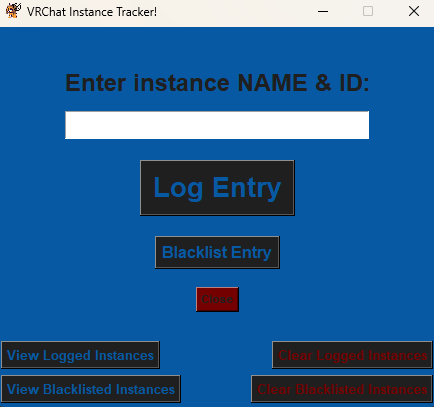
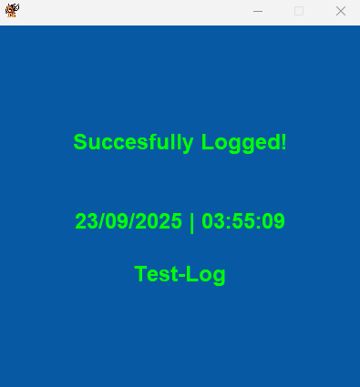
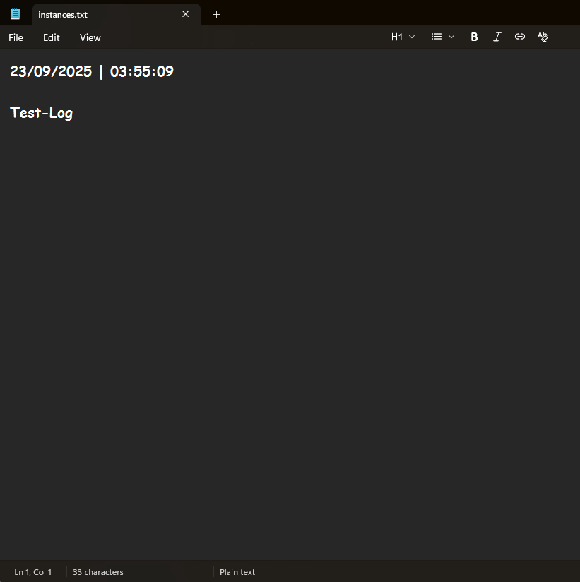
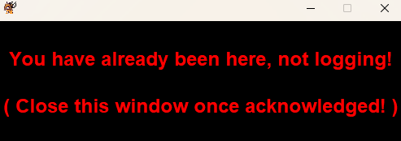
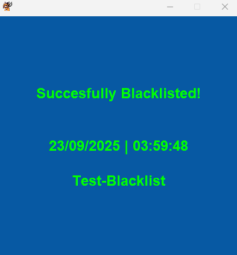
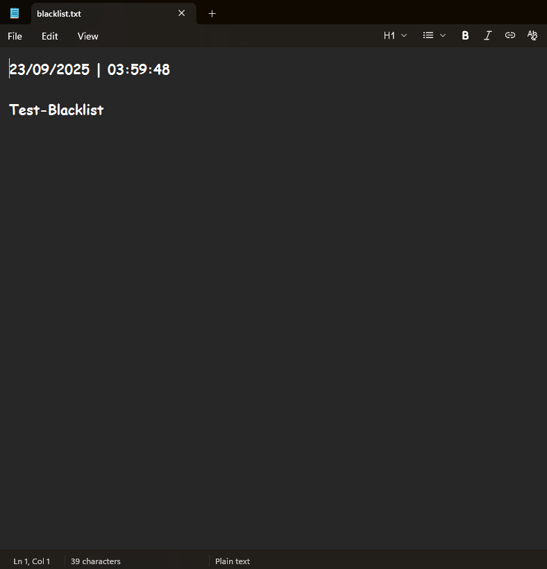
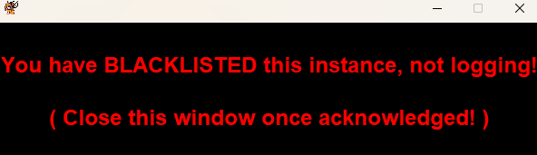

# | [VRChat](https://hello.vrchat.com) Instance Tracker!

This program is for the
VRChat players who constantly find
themselves re-joining the same instances
they've already visited when world
hopping!

This program's aim is to
provide somewhat of a solution,
or at least a relief
to this problem!

> [!NOTE]
> This program does NOT interact,
> or interfere with the VRChat
> client in any way whatsoever!
> As mentioned in the general
> description below, it is essentially
> a simple text logger/checker
> meant to run **independently** alongside
> the client!

## | General Description:
This program is essentially a
simple text logger that will
check every new input against
previously logged ones inside of
a text file and deny
if already logged. It also
provides the option to blacklist
instances in a seperate text
file if needed! There used
to be an in-game mod
for this, however since those
are far gone I've chosen
to create this alternative for
myself, and others who may
experience this same inconvenience!

> [!NOTE]
> Previous versions
> [**1.3**](https://github.com/Py-Kat/VRC-InstanceTracker/releases/tag/v1.3.0),
> and
> [**1.2**](https://github.com/Py-Kat/VRC-InstanceTracker/releases/tag/v1.2.0)
> are terminal UI based and
> do not have a GUI,
> but provide essentially the same
> function!
> 
> These versions can be found
> by viewing the previous Github
> releases, or by clicking the
> links above!

## | Previews!

### Main Menu:

---

### Logging Instances:

#### The window shown when the user attempts to log an already logged instance:

---

### Blacklisting Instances:

#### The window shown when the user attempts to log an instance which has been blacklisted:

# | Final Note:
If you experience any issues,
or have any suggestions I'd
love to hear them! I
am new to programming so
criticism is appreciated!